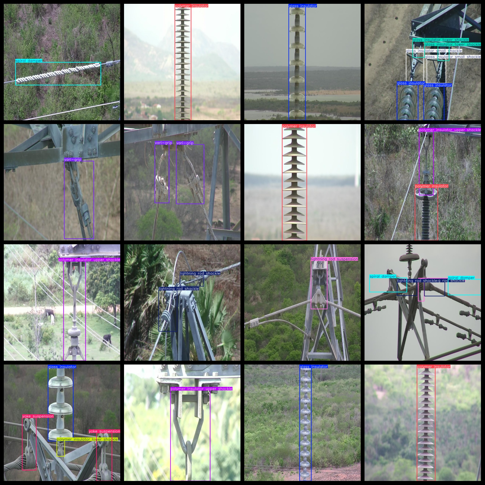
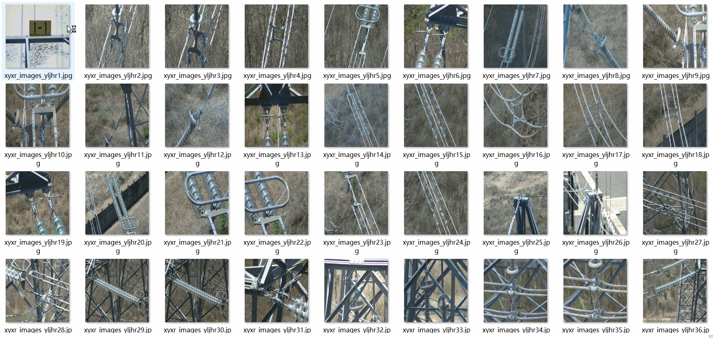

# UAV View Power Inspection LINES Equipment Detection Dataset 7933 imagesVOC+YOLO format

The UAV View Power Inspection LINES Equipment Detection Dataset consists of 7933 images in the VOC+YOLO format.

The dataset is organized as follows:
- Images (jpg files): 7933
- Annotations (xml files): 7933
- Annotations (txt files): 7933
- Number of categories: 18
- Repository: datasets_sl
- Categories in labels folder (noting that the yolo format category order does not correspond to this, but rather based on the "labels" folder's "classes.txt"): ["glass insulator", "glass insulator big shackle", "glass insulator small shackle", "glass insulator tower shackle", "lightning rod shackle", "lightning rod suspension", "polymer insulator", "polymer insulator lower shackle", "polymer insulator tower shackle", "polymer insulator upper shackle", "spacer", "sphere", "spiral damper", "stockbridge damper", "tower id plate", "vari-grip", "yoke", "yoke suspension"]

Label translations:
- Glass insulator: glass insulator
- Glass insulator big shackle: glass insulator big shackle
- Glass insulator small shackle: glass insulator small shackle
- Glass insulator tower shackle: glass insulator tower shackle
- Lightning rod shackle: lightning rod shackle
- Lightning rod suspension: lightning rod suspension
- Polymer insulator: polymer insulator
- Polymer insulator lower shackle: polymer insulator lower shackle
- Polymer insulator tower shackle: polymer insulator tower shackle
- Polymer insulator upper shackle: polymer insulator upper shackle
- Spacer: spacer
- Sphere: sphere
- Spiral damper: spiral damper
- Stockbridge damper: stockbridge damper
- Tower id plate: tower id plate
- Vari-grip: vari-grip
- Yoke: yoke
- Yoke suspension: yoke suspension

Total number of boxes: 22523

Number of images per category:
- Glass insulator: 1912
- Glass insulator big shackle: 63
- Glass insulator small shackle: 68
- Glass insulator tower shackle: 53
- Lightning rod shackle: 99
- Lightning rod suspension: 617
- Polymer insulator: 2332
- Polymer insulator lower shackle: 1379
- Polymer insulator tower shackle: 44
- Polymer insulator upper shackle: 1310
- Spacer: 67
- Sphere: 15
- Spiral damper: 744
- Stockbridge damper: 1425
- Tower id plate: 198
- Vari-grip: 467
- Yoke: 1336
- Yoke suspension: 2197

Image resolution: 640x640

Annotation tool used: labelImg

Dataset enhancement status: Yes

Annotation rules: Mark categories with square boxes

Important Note: The dataset does not include a training/validation/test split and must be partitioned by the user.

Special Remark: This dataset does not guarantee any accuracy in the trained models or weights file.

## Images

---

Here is a pay link on Stripe (https://buy.stripe.com/3cs8yP7sY87d0vu9AB). Please contact me lonlonago@foxmail.com after funding $89, and I will send you a complete data files, thank you!

